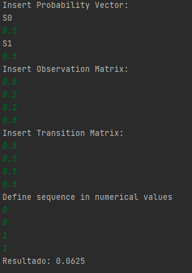

<h1>&#9968 Hidden Markovs Model's Foward Algorithm;</h1>

The content of this repository served as an assignment project requested for the course Probabilistic Graphical Models at the <a href="https://www.inaoep.mx/">INAOE</a> as a student of the Master in Science in Computer Science. All the resources presented in the versions of this code was obtained from the class book that you can find in the references part. 

<strong>This application of the algorithm and information was for an only educational purposes</strong>

<h3>Description:</h3> Implement the Forward algorithm for estimating the probability of a sequence of observations given the model. The program should work for any discrete HMM and any observation sequence.

Student Involved:
- Mario De Los Santos. Github: <a href="https://github.com/MarSH-Up">MarSH-Up</a>. Email: madlsh3517@gmail.com

<em>Instructions</em>
1. Download the repository's file
2. Verify that the C++ version is at least C++ 14
3. Call the functions marked in the documentation

<em>Example</em>

To run in your would need basically 3 staments:
1. Prior Probability Vector
2. Transition Matrix
3. Observation Matrix
4. Sequences to look.

- The matrixes follow the next structure:
1. Prior Probability Vector: It's basically an array: 
        π = S0,S1,S2, ..., S10
    - The number of accepted states can be improved by modifying px variable, right now delimited to 10 possibles states, Sn.
2. Transition Matrix: representes the cost of the transition between states.
    -    *        S0 S1 S2 .. Sn
         * A = S0 .  .  .
         *     S1 .  .  .
         *     S2 .  .  .
         *     .  .  .  .
         *     .  .  .  .
         *     Sn .  .  .
3. Observation Matrix:represent the probability for each state to reach determinated "status"
    -   *        S0 S1 S2 S3 ... Sn
        * B = O0 .  .  .
        *     O1 .  .  .
        *     O2 .  .  .
        *     O3 .  .  .
        *     .  .  .  .
        *     On .  .  .

#References
-  Sucar, L. E. (2020). Probabilistic graphical models. Advances in Computer Vision and Pattern Recognition.London: Springer London. doi, 10(978), 2
